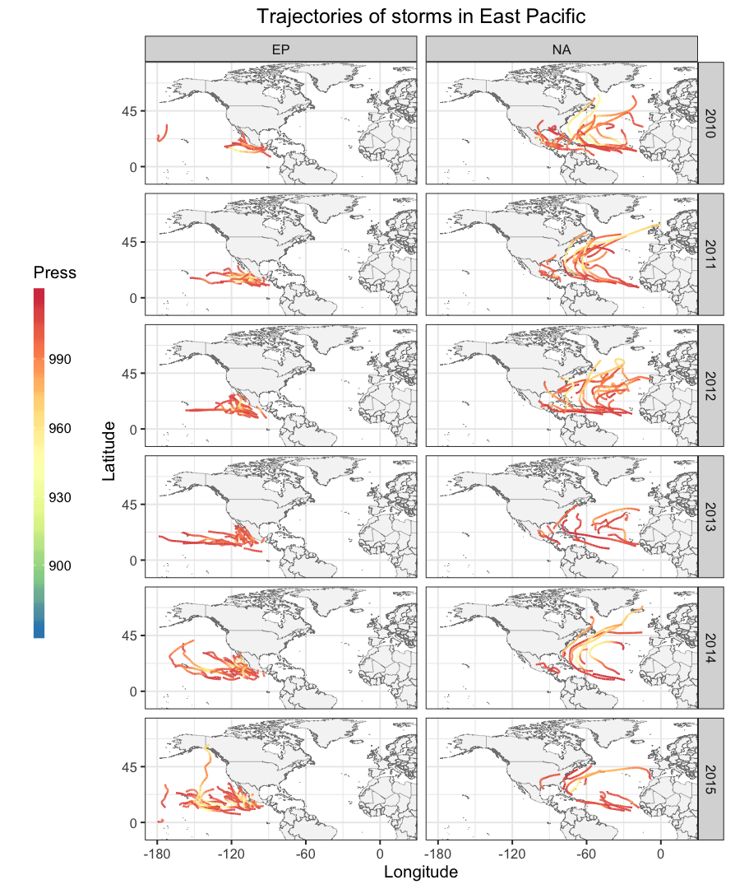
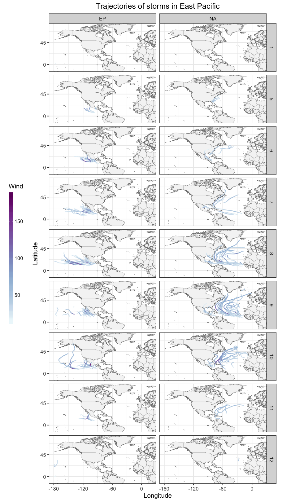
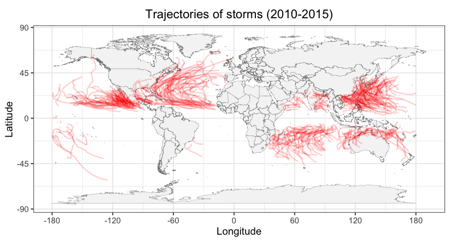

Workout 1: IBTrACS Storms Data
================
Jingyuan Liu
10/18/2019

## Introduction

Tropical cyclone is an atmospheric phenomenon that attract widespread
interests not only in the scientific field but also in the public due to
its server damage to human beings. IBTrACs project of NOAA manages a
centralized archive of tropical cyclone data to facilitate our
understanding of the distribution and evolution of storms. In this
project, cyclones data from year 2010 to 2015 were download from the
IBTrACs project website. Twelve variables of cyclone data were extracted
from the CSV files and combined into one CSV file for exploratory
analysis in this project.

The analysis in this project proceeds in three steps. As the combined
CSV data contains missing or NA values, data cleaning will be first
described. The statistical information about the variables in the
spatial and temporal dimensions will then be explored aiming at
obtaining a general understanding of the variables in the data. To be
specific, the spatial distribution of cyclones and its temporal
variation from year 2010 to 2015 are explored and discussed.

## Data cleaning

The code bellow imports the combined CSV file. Names for 12 variables
are recoded and the missing values represented by -999, -1, 0 are
converted to NA. All records with NA values are discarded for the
following analysis.

``` r
library(readr)
library(dplyr)
```

    ## 
    ## Attaching package: 'dplyr'

    ## The following objects are masked from 'package:stats':
    ## 
    ##     filter, lag

    ## The following objects are masked from 'package:base':
    ## 
    ##     intersect, setdiff, setequal, union

``` r
library(tidyr)
library(ggplot2)
library(lubridate)
```

    ## 
    ## Attaching package: 'lubridate'

    ## The following object is masked from 'package:base':
    ## 
    ##     date

``` r
ibt <- read_csv("../data/ibtracs-2010-2015.csv", na = c(""),
                col_types = list(col_character(), col_integer(), col_character(),
                                 col_factor(), col_character(), col_character(), 
                                 col_character(), col_character(), col_double(), 
                                 col_double(), col_double(), col_double()))
names(ibt) <- c("serial_num", "season", "num", "basin", "sub_basin", "name", 
                "iso_time", "nature", "latitude", "longitude", "wind", "press")
# convert missing values to NA
ibt <-ibt %>%
  mutate(latitude = na_if(latitude, "-999")) %>%
  mutate(longitude = na_if(longitude, "-999")) %>%
  mutate(wind = na_if(wind, "-1")) %>%
  mutate(wind = na_if(wind, "-999")) %>%
  mutate(wind = na_if(wind, "0")) %>%
  mutate(press = na_if(press, "-1")) %>%
  mutate(press = na_if(press, "-999")) %>%
  mutate(press = na_if(press, "0"))
ibt <- na.omit(ibt)
```

## Temporal variation of storms

Basic statistics can be used to acquire some interesting information
about the cyclones. The code below output the number of storms occurred
in each year. The results show that over 90 storms occurred in 2013 and
2015. The number of storms occurred can also be explored on monthly
scale. The code below computes the numbers of storms occurred over the
months of a year. The results show that storms do not occurred uniformly
throughout the year. Months 8, 9, 10 have seen more storm activity,
especially September experienced the highest number of storms over a
year.

``` r
# number of (unique) storms in each year
ibt %>%
  group_by(season) %>%
  distinct(serial_num) %>%
  count()
```

    ## # A tibble: 6 x 2
    ## # Groups:   season [6]
    ##   season     n
    ##    <int> <int>
    ## 1   2010    81
    ## 2   2011    86
    ## 3   2012    85
    ## 4   2013    98
    ## 5   2014    91
    ## 6   2015   100

``` r
# by month
ibt$month <- month(as_date(ibt$iso_time))
ibt %>%
  group_by(month) %>%
  distinct(serial_num) %>%
  count()
```

    ## # A tibble: 12 x 2
    ## # Groups:   month [12]
    ##    month     n
    ##    <dbl> <int>
    ##  1     1    52
    ##  2     2    44
    ##  3     3    34
    ##  4     4    24
    ##  5     5    26
    ##  6     6    50
    ##  7     7    67
    ##  8     8    92
    ##  9     9   101
    ## 10    10    83
    ## 11    11    40
    ## 12    12    37

More direct way to show the variation on storm activity is mapping the
trajectories of the storms occurred at different time periods The two
figures below offer the variation of trajectories over the Eastern
Pacific and Northern Atlantic at different time scales. The similar
patterns can be seen from the map that number storms tend to be uniform
in years but highly variable in months over a
year.




The duration of storms was computed from the code bellow. The statistics
of the duration of all storms shows that the maximum duration of the
storms is about 24 days and the average duration of the storms is nearly
8 days.

``` r
ibt$date <- lubridate::as_date(ibt$iso_time)
ans <- ibt %>%
  group_by(serial_num) %>%
  mutate(dur = as.numeric(max(date) - min(date), units = "days"))
summary(ans$dur)
```

    ##    Min. 1st Qu.  Median    Mean 3rd Qu.    Max. 
    ##   0.000   6.000   8.000   8.539  11.000  24.000

``` r
ggplot(data = ans) +
  geom_histogram(aes(x = dur), bins = 20) +
  xlab("Days") + ylab("Frequency") + 
  ggtitle("Distribution of storms duration") +
  theme(plot.title = element_text(hjust = 0.5)) 
```

<!-- -->

The wind speed and pressure data were also been recorded for each storm.
The storms with the highest wind speed can be identified by the code
below. According to the histogram, most storms lasted around 8 day, only
a few storms deviated heavily from the typical duration of storms. The
code below output the storms with its maximum speed in descending order.

``` r
ibt %>%
  select(serial_num, wind) %>%
  group_by(serial_num) %>%
  mutate(max_speed = max(wind)) %>%
  select(serial_num, max_speed) %>%
  distinct() %>%
  arrange(desc(max_speed))
```

    ## # A tibble: 541 x 2
    ## # Groups:   serial_num [541]
    ##    serial_num    max_speed
    ##    <chr>             <dbl>
    ##  1 2015293N13266       185
    ##  2 2010169N13266       140
    ##  3 2014234N12261       140
    ##  4 2010251N14337       135
    ##  5 2011199N10271       135
    ##  6 2014142N10254       135
    ##  7 2015066S08170       135
    ##  8 2015238N10255       135
    ##  9 2015270N27291       135
    ## 10 2014160N15259       130
    ## # … with 531 more rows

# Spatial variation of storms

Storms activity variation at different regions on Earth can be explored
from different scales. First, the differences of storms activity in the
two hemisphere is discussed by computing total number of storms occurred
per hemisphere during the years 2010-2015. The number of storms in the
north hemisphere is nearly triple of the number in southern hemisphere.
Therefore, it can be observed that the north hemisphere is the region
that suffers the storms more severely.

``` r
# total number of storms per hemisphere
ibt %>%
  group_by(latitude >= 0) %>%
  distinct(serial_num) %>%
  count()
```

    ## # A tibble: 2 x 2
    ## # Groups:   latitude >= 0 [2]
    ##   `latitude >= 0`     n
    ##   <lgl>           <int>
    ## 1 FALSE             141
    ## 2 TRUE              400

To determine the variation of storm activity at different basin regions,
numbers of storms occurred in different basins over the years are
summarized by the following code. According to the output, Western
Pacific suffered storms most frequently but the Southern Atlantic region
rarely experienced storms. Southern Indian, Eastern Pacific and North
Atlantic also experienced heavily storm activity.

``` r
ibt %>%
  group_by(basin) %>%
  distinct(serial_num) %>%
  count()
```

    ## # A tibble: 7 x 2
    ## # Groups:   basin [7]
    ##   basin     n
    ##   <fct> <int>
    ## 1 SI       88
    ## 2 SP       57
    ## 3 WP      140
    ## 4 SA        2
    ## 5 NI       54
    ## 6 EP      113
    ## 7 NA       97

The previous discussion of the spatial variation of storm activity can
be clearly seen from the trajectories on a map. The map provided below
shows all the trajectories of storms occurred during 2010-2015. From the
map, it can be seen that northern hemisphere and regions around the
Atlantic sea and Pacific sea experienced most storms. And a high spatial
variation of storm activity can be
confirmed



## Conclusion

Data processing and analysis in R has been practiced in this project.
The tropical cyclone data from 2010 to 2015 was used to explore the
basic statistical information of the storm variables. The storm activity
at different time scales and locations were explored. A high variation
of storm activity is revealed from the analysis.
